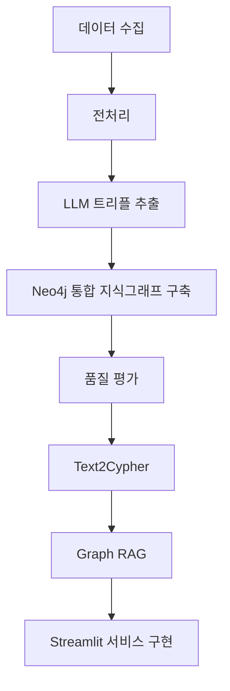

# B2B 기업 관계 지식그래프

B2B 영업/마케팅 담당자가 신규 고객사, 협력사, 하청업체, 공급망 파트너를 더 빠르게 찾을 수 있도록 기업 간 연결 관계를 지식그래프로 구축하고, 산업 생태계를 탐색할 수 있게 하는 서비스입니다.

## 프로젝트 배경

B2B 영업/마케팅에서는 새로운 고객사나 협력사를 발굴하기 위해 기업명, 산업분류, 뉴스, 공시, 홈페이지, 채용 정보, 거래처 정보 등을 따로 검색해야 합니다. 정보가 여러 곳에 흩어져 있어 특정 기업이 어떤 산업 생태계 안에 있는지, 어떤 기업들과 연결되어 있는지 한눈에 파악하기 어렵습니다.

특히 실무자는 다음과 같은 질문에 빠르게 답해야 합니다.

- 이 기업과 연결된 계열사 또는 종속 기업은 어디인가?
- 이 기업과 비슷한 일을 하는 기업은 어디인가?
- 특정 산업에서 영업 대상이 될 만한 기업은 어디인가?
- 해당 기업의 규모와 최근 상황은 어떤가?

이 프로젝트는 기업, 산업, 제품, 거래 관계, 협력 관계를 연결한 지식그래프를 구축해 사용자가 산업 생태계를 탐색하고 잠재 고객사나 파트너사를 발견할 수 있도록 돕는 것을 목표로 합니다.

## 주요 사용자

| 사용자 | 현재 방식 | 필요한 기능 |
| --- | --- | --- |
| 영업/마케팅 직원 | 포털 검색, 기업 홈페이지, 뉴스, 공시, 엑셀 리스트를 활용해 수작업으로 기업을 조사 | 기업 검색, 관계 그래프 탐색, 유사 기업 추천, 자연어 질의응답 |

## 핵심 기능

### MVP 기능

| 기능 | 설명 | 담당 |
| --- | --- | --- |
| 기업 검색 | 기업명, 산업, 키워드로 기업을 검색하고 기본 정보를 확인합니다. | 이건호 |
| 기업 상세 페이지 | 기업의 산업, 주요 키워드, 관련 기업, 관계 유형을 한 화면에서 제공합니다. | 김수민 |
| 기업 관계 그래프 | 기업 간 관계를 노드와 엣지로 시각화해 연결 구조를 탐색할 수 있게 합니다. | 엄가현 |
| 관계 유형 분류 | 계열사, 종속 기업 등 기업 간 관계 유형을 구분해 보여줍니다. | 송진명 |
| 기업 데이터 전처리 | 수집한 기업 데이터를 정제하고 중복, 누락, 짧은 문서를 처리합니다. | 김동석 |
| 자연어 질의응답 | 사용자가 질문하면 그래프 기반으로 관련 기업과 관계를 찾아 답변합니다. | 이건호 |

### 추가 기능

| 우선순위 | 기능 | 설명 | 담당 |
| --- | --- | --- | --- |
| P1 | 산업 생태계 맵 | 특정 산업을 선택하면 핵심 기업, 주변 기업, 공급망 구조를 시각화합니다. | 엄가현 |
| P1 | 유사 기업 추천 | 선택한 기업과 산업, 키워드, 관계 구조가 유사한 기업을 추천합니다. | 엄가현 |
| P2 | 관계 근거 제공 | 뉴스, 기업 설명, 웹 문서 등 관계를 추출한 근거 문장을 함께 제공합니다. | 송진명 |

## 데이터

| 데이터셋 | 출처 | 수집 방법 | 활용 영역 | 담당 |
| --- | --- | --- | --- | --- |
| 금융위원회 기업기본정보 | [공공데이터포털](https://www.data.go.kr/data/15043184/openapi.do) | 공공데이터포털 API | 지식그래프 구축, Graph RAG 개발 | 김동석, 엄가현, 송진명, 김수민 |

현재 저장소에는 원천 데이터와 전처리 결과가 `data/raw`, `data/clean` 경로에 정리되어 있습니다.

주요 전처리 산출물:

- `data/clean/기업개요_최종.csv`
- `data/clean/기업개요_최종.jsonl`
- `data/clean/계열회사_전처리.csv`
- `data/clean/종속기업_정리.csv`
- `data/clean/모기업_계열사_종속기업_통합.csv`

## 기술 스택

| 영역 | 기술 |
| --- | --- |
| 데이터 분석 및 전처리 | pandas |
| 임베딩 및 벡터 DB | OpenAI Embeddings |
| LLM | OpenAI, 프롬프트 엔지니어링 |
| 그래프 데이터베이스 | Neo4j, Cypher |
| 화면 및 배포 | Streamlit Cloud |
| 협업 | GitHub, Notion, FigJam |

## 아키텍처



## 프로젝트 흐름

1. 공공데이터포털 API로 기업 기본 정보와 관계 데이터를 수집합니다.
2. 수집 데이터를 정제하고 중복, 누락, 짧은 문서를 처리합니다.
3. 기업 설명과 관계 데이터를 기반으로 기업 간 관계 트리플을 추출합니다.
4. Neo4j에 기업, 산업, 관계 유형을 노드와 엣지로 저장합니다.
5. Cypher 질의와 Graph RAG를 이용해 자연어 질문에 답변합니다.
6. Streamlit 화면에서 기업 검색, 상세 조회, 관계 그래프 탐색 기능을 제공합니다.

## 저장소 구조

```text
.
├── data/
│   ├── raw/       # 원천 수집 데이터
│   └── clean/     # 전처리 완료 데이터
├── notebooks/     # 데이터 수집 및 전처리 노트북
├── main.py
├── pyproject.toml
└── README.md
```

## 기대 효과

- 수작업 기업 리서치 시간을 줄이고 탐색 속도를 높입니다.
- 기업 간 계열사, 종속 기업, 유사 기업 관계를 시각적으로 파악할 수 있습니다.
- 특정 산업 안에서 영업 가능성이 높은 기업을 더 쉽게 발견할 수 있습니다.
- 관계 기반 질의응답을 통해 단순 검색보다 맥락 있는 기업 정보를 제공합니다.

## 실행 방법

현재 프로젝트는 Python 3.12 이상을 기준으로 구성되어 있습니다.

```bash
uv sync
uv run python main.py
```

Streamlit 화면 구현 이후에는 실행 명령을 서비스 진입점에 맞게 업데이트할 예정입니다.
