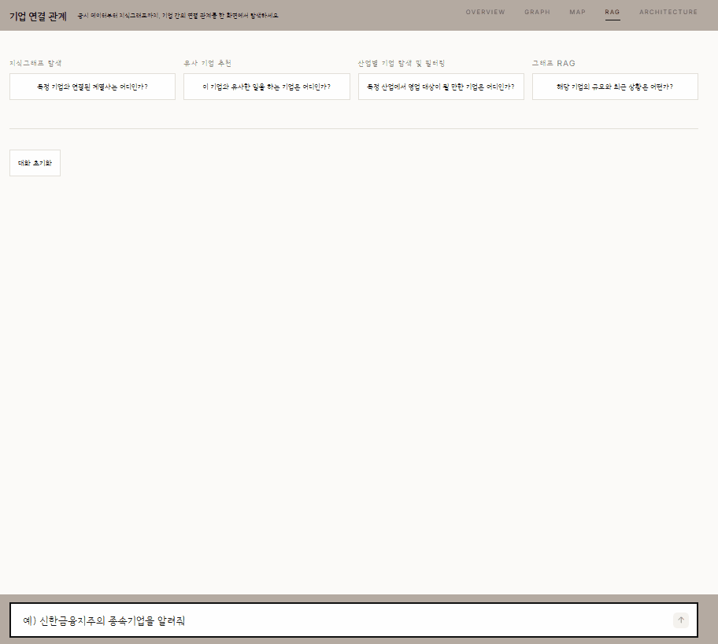
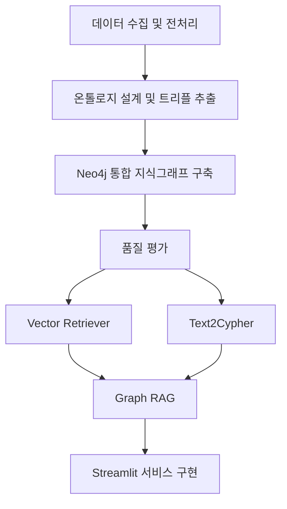

# 🖥️ B2B 기업 관계 지식그래프

기업의 계열·종속 관계를 Neo4j 지식그래프로 연결하고, 자연어 질문을 Text2Cypher와 뉴스 벡터 검색으로 응답하는 B2B 기업 리서치 GraphRAG 프로토타입

### 📌 프로젝트 배경

B2B 영업·마케팅 담당자는 신규 고객사, 협력사, 공급망 파트너를 찾기 위해 기업 홈페이지, 공시, 뉴스, 산업 자료와 내부 목록을 따로 확인합니다. 이 방식에는 다음과 같은 한계가 있습니다.

특히 실무자는 다음과 같은 질문에 빠르게 답해야 합니다.

- 이 기업과 연결된 계열사 또는 종속 기업은 어디인가?
- 이 기업과 비슷한 일을 하는 기업은 어디인가?
- 특정 산업에서 영업 대상이 될 만한 기업은 어디인가?
- 해당 기업의 규모와 최근 상황은 어떤가?

이 프로젝트는 금융위원회 기업기본정보를 정제·보강해 기업 관계 그래프를 만들고, 뉴스 기사를 벡터 검색으로 연결한 뒤, LangChain Agent가 Neo4j와 뉴스 벡터 인덱스를 조회해 자연어 질문에 답하는 흐름을 구현합니다.

### 📌 주요 사용자

| 사용자 | 현재 방식 | 필요한 기능 |
| --- | --- | --- |
| 영업/마케팅 직원 | 포털 검색, 기업 홈페이지, 뉴스, 공시, 엑셀 리스트를 활용해 수작업으로 기업을 조사 | 기업 검색, 관계 그래프 탐색, 유사 기업 추천, 자연어 질의응답 |

###  📌 핵심 기능

#### 📃 MVP 기능

| 담당 | 기능 | 설명 |
| --- | --- | --- |
| 이건호 | 기업 검색, 자연어 질의응답 | 기업명, 산업, 키워드로 기업을 검색 및 기본 정보 확인 <br> 사용자가 질문하면 그래프 기반으로 관련 기업과 관계를 찾아 답변 |
| 김수민 | 기업 상세 페이지 | 기업의 산업, 주요 키워드, 관련 기업, 관계 유형을 한 화면에 제공 |
| 엄가현 | 기업 관계 그래프, 산업 생태계 맵 구축, 유사 기업 추천 | 기업 간 관계를 노드와 엣지로 시각화해 연결 구조를 탐색 <br> 특정 산업을 선택하면 핵심 기업, 주변 기업, 공급망 구조 시각화 |
| 송진명 | 관계 유형 분류, 관계 근거 제공 | 계열사, 종속 기업 등 기업 간 관계 유형 구분 <br> 뉴스 기사 등 관계를 추출한 근거 문장 제공 |
| 김동석 | 기업 데이터 수집 및 전처리 | 수집한 기업 데이터를 정제하고 중복, 누락, 짧은 문서 처리 | 

#### 🤖 Streamlit 화면 

**🖼️ 지식그래프**


**🖼️ 맵**


**🖼️ 챗봇**



#### 🗨️ 팀원 회고

김동석 : 일부 데이터 전처리와 노드 생성, 온톨로지 수정, 골드셋 평가를 담당하며 데이터 품질이 GraphRAG 답변의 정확도를 좌우한다는 점을 체감했다. 전체 프로젝트를 통해 그래프 설계부터 검색·응답까지의 흐름을 이해했으며, 명확한 스키마와 지속적인 검증, 팀원 간 협업의 중요성을 배웠다.

엄가현: 공공데이터포털의 기업,계열사,종속기업 데이터를 정제한 뒤 데이터 누락·중복과 관계 근거의 신뢰도를 점검하는 과정에서 모델 성능만큼 데이터 품질 관리와 팀 간 인터페이스 합의가 중요하다는 점을 배웠습니다. 벡터 검색에 활용할 뉴스 데이터를 수집 방식을 설계하고 충분한 기사를 확보하는 과정에서 데이터 수집의 현실적인 제약을 경험했습니다. 이를 통해 기능 구현뿐 아니라 서비스에 필요한 데이터를 안정적으로 확보하는 과정도 중요하다는 점을 배웠습니다.

이건호: 그래프db를 이용한 조회도구들을 만들고 에이전트로 작업하는 과정에서, 실제 그래프 db의 구조와 그 구조를 기반으로 하는 온톨로지의 역할에 대해서 배웠습니다. 또한 이를 바탕으로 하는 그래프 db기반 사이퍼 조회의 도구를 만들어 해당 작성을 위한 지침, 오류 및 오조작에 대한 방어로직과 서로의 연결을 위한 프롬프트에 대해서 배웠습니다. 또한 전체적인 흐름과 조작에 있어서의 각 도구들과 에이전트의 호출과 입력의 정확한 일치가 중요하다는 것을 느꼈습니다.

송진명 : 데이터 품질과 관계 근거를 꼼꼼히 검증하고 팀원들과 인터페이스를 맞추며 협력해 만족스러운 결과를 얻을 수 있었지만, 뉴스 데이터 수집과 벡터 검색 품질을 안정적으로 확보하고 전처리하는 과정에서는 어려움이 있었기 때문에 다음에는 초기 단계부터 데이터 검증 기준과 수집 전략을 명확히 정한 뒤 진행하고 싶습니다

김수민 : PM으로서 프로젝트 방향과 우선순위를 설정하고, 일정 조율과 역할 간 협업을 이끌며 전체 진행을 관리했다. 온톨로지 합의, 품질평가 기준 수립, Streamlit 통합과 발표까지 주요 의사결정과 결과물 완성을 주도했다.
데이터 전처리 규칙과 관계별 evidence 생성 기준을 정하는 과정에서 시행착오가 있었고, 트리플 추출에도 예상보다 많은 시간이 소요됐다. 그럼에도 이슈를 지속적으로 정리하고 팀원들과 해결 방향을 맞춰 최종 데모를 안정적으로 완성한 점이 가장 큰 성과였다. 다음에는 초기 단계에서 데이터 구조와 전처리·추출 기준을 더 명확히 정의해 일정 리스크를 줄이고 프로젝트 완성도를 높이고 싶다.


### 📌 데이터

| 데이터셋 | 출처 | 수집 방법 | 활용 영역 | 담당 |
| --- | --- | --- | --- | --- |
| 금융위원회 기업기본정보 | [공공데이터포털](https://www.data.go.kr/data/15043184/openapi.do) | 공공데이터포털 API | 지식그래프 구축, Graph RAG 개발 | 김동석, 엄가현, 송진명, 김수민 |
| 네이버 뉴스 기사 수집 | [네이버 개발자도구](https://developers.naver.com/docs/serviceapi/search/news/news.md) | 네이버 개발자도구 API | Vector Retriever 개발 | 엄가현 |

현재 저장소에는 원천 데이터와 전처리 결과가 `data/raw`, `data/clean` 경로에 정리되어 있습니다.

#### 📃 주요 전처리 산출물

- `data/clean/최종_기업개요.csv`
- `data/clean/계열회사_전처리.jsonl`
- `data/clean/최종_종속기업_정리.csv`
- `data/clean/최종_모기업_계열사_종속기업_통합.csv`
- `data/clean/최종_뉴스기사.jsonl`

#### 📃 통합 데이터의 관계 유형

| 관계 경로 | 행 수 | 비율 |
| --- | --- | --- |
| 모기업 → 계열회사 | 9,513 |  54.69% |
| 모기업 → 종속기업 | 1,831 |  10.52% |
| 모기업 → 계열회사 → 종속기업 | 6,054 |  34.80% |


### 📌 기술 스택

| 영역 | 기술 |
| --- | --- |
| 데이터 분석 및 전처리 | pandas |
| 임베딩 및 벡터 DB | OpenAI Embeddings |
| LLM | OpenAI, 프롬프트 엔지니어링 |
| 그래프 데이터베이스 | Neo4j, Cypher |
| 화면 및 배포 | Streamlit Cloud |
| 협업 | GitHub, Notion, FigJam |

### 📌 아키텍처



### 📌 프로젝트 흐름

1. 공공데이터포털 API로 기업 기본 정보와 관계 데이터 수집.
2. 수집 데이터를 정제하고 중복, 누락, 짧은 문서 처리.
3. 기업 설명과 관계 데이터를 기반으로 기업 간 관계 트리플 추출.
4. Neo4j에 모기업, 계열사, 종속기업, 관계 유형을 노드와 엣지로 저장.
5. Cypher 질의와 Graph RAG를 이용해 자연어 질문에 답변.
6. Streamlit 화면에서 기업 검색, 상세 조회, 관계 그래프 탐색 기능 제공.

### 📌 저장소 구조

```text
.
├── data/
│   ├── raw/                          # API 원천 CSV, 수집 메타데이터
│   ├── clean/                        # 정제·보강 CSV, 그래프 노드·트리플·뉴스 JSONL, 임베딩 캐시
│   └── quality/                      # 품질 리포트 + GDS 리포트·속성, 수동 검토 샘플 (모두 이 폴더)
├── notebooks/
│   ├── data-collect.ipynb            # 기업기본정보 수집
│   ├── data-prep_afilCmpy.ipynb      # 계열회사 전처리
│   ├── 01~03_subsid_*.ipynb          # 종속기업 병합·점검·정제
│   ├── all_data_prep.ipynb           # 관계 통합 데이터 생성
│   ├── 04_schema_check.ipynb         # 스키마 점검
│   ├── 진명_evidence수정.ipynb        # 근거·그래프 산출물 수정
│   └── validate_triples.ipynb        # 트리플 품질 검증(노트북 버전)
├── src/
│   ├── agent/
│   │   ├── agent.py                  # LangChain Agent (그래프 조회 + 뉴스 벡터 검색)
│   │   └── tools/
│   │       ├── graph_ontology.json       # 온톨로지 v1
│   │       ├── graph_ontology_v2.json    # 온톨로지 v2 (Section, News, RELATED_TO 포함)
│   │       ├── text2cypher.py             # 엔티티 확인·그래프 조회 도구
│   │       └── news_vector.py             # 뉴스 벡터 검색 도구
│   ├── enrich/
│   │   ├── common.py                  # 보강 파이프라인 공용 유틸
│   │   ├── step1_rule_fill.py         # 1단계: 규칙 기반 보강
│   │   ├── step2_llm_fill.py          # 2단계: 웹검색 MCP + LLM 보강
│   │   ├── step3_apply.py             # 3단계: 검증 후 반영
│   │   ├── step4_side_csvs.py         # 4단계: 개별 CSV 보강
│   │   └── naver_search_mcp.py        # 네이버 검색 MCP 서버
│   ├── neo4j/
│   │   ├── load_graph.py              # 그래프 적재·검증
│   │   ├── prepare_graph_v2.py        # v2 그래프 준비
│   │   ├── load_news_vector.py        # 뉴스 노드·임베딩·벡터 인덱스 적재
│   │   ├── gds_report.py              # GDS PageRank/Leiden 리포트 생성 (data/quality/에 저장)
│   │   └── load_gds_properties.py     # GDS 속성 재적재 (data/quality/에서 읽음)
│   ├── streamlit/
│   │   ├── app.py                     # Overview/Graph/RAG/Architecture 통합 UI
│   │   └── chatbot.py                 # Graph RAG 챗봇 (단독 실행 가능)
│   └── validate_triples.py            # 트리플 품질 검증 스크립트 (data/quality/에 저장, 루트 버전)
├── tests/                             # unittest 기반 자동화 테스트
├── collect_news.py                    # 상위 100개 기업 뉴스 수집 배치
├── test_naver_news.py                 # 네이버 뉴스 API 단건 조회 스크립트
├── 데이터명세.ipynb                    # 통합 데이터 명세
├── main.py                            # 현재 Hello World 수준의 기본 진입점
├── pyproject.toml
├── uv.lock
├── .env.example                       # 환경변수 예시 (Naver API 키 미포함)
└── README.md
```

### 📌 기대 효과 및 한계점

- 기업별 계열, 종속 관계와 관련 뉴스 조사 시간을 줄일 수 있다.
- 기업명 검색만으로 관련 기업, 지역, 업종, 최근 뉴스를 함께 탐색할 수 있다.
- 원천 행과 관계 근거, 뉴스 원문 URL을 보존해 그래프, 챗봇 답변을 검토할 수 있다.
- GDS 분석으로 그래프 내 핵심 허브와 기업 군집을 파악해 영업, 리서치 우선순위를 세울 수 있다.
- 향후 벡터 검색과 그래프 확장을 결합하면 정확한 엔티티 탐색과 다단계 관계 추론을 함께 제공할 수 있다.

#### 📃 추출품질 검증 리포트

전체 추출 트리플 26,072건 중 온톨로지 스키마 검사는 100% 통과했으며, 원천 행의 근거 문장과 일치하는 트리플은 25,692건으로 확인되었습니다.

| 지표 | 값 |
| --- | ---: |
| 전체 트리플 수 | 26072 |
| 스키마 통과 트리플 수 | 26072 |
| 근거 원문 일치 트리플 수 | 25692 |
| 수동 검토 대상 수 | 25692 |
| 기각 트리플 수 | 380 |
| 스키마 준수율 | 1.0000 |
| 근거 원문 일치율 | 0.9854 |
| 수동 검토 대상 비율 | 0.9854 |

기각된 380건은 관계 구조 자체의 문제라기보다, 일부 트리플에서 원천 데이터 행을 추적할 수 있는 식별자가 누락되었거나 해당 원천 행을 다시 찾지 못한 것이 주요 원인이었습니다.

#### 📃 GDS 그래프 분석 결과 

품질 검증을 통과한 그래프를 Neo4j GDS 기준으로 분석한 결과, companyGraph는 8,190개 노드와 51,650개 관계로 구성되었습니다. PageRank 기준 핵심 허브는 서울, 금융, 제조, 경기, 서비스 순으로 나타났으며, Leiden 커뮤니티 탐지에서는 총 77개 커뮤니티가 확인되었습니다. 가장 큰 커뮤니티는 2,640개 노드를 포함해 기업, 지역, 산업 노드가 함께 묶이는 구조를 보였습니다.


### 📌 실행 방법

현재 프로젝트는 Python 3.12 이상을 기준으로 구성되어 있습니다.

```bash
uv sync
```

