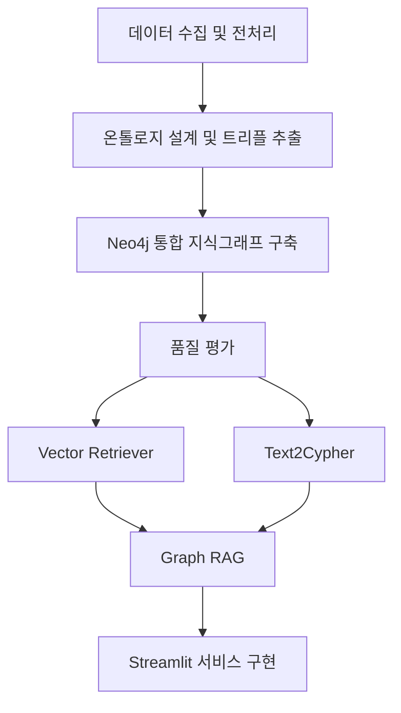

# 🖥️ B2B 기업 관계 지식그래프

기업의 계열·종속 관계를 Neo4j 지식그래프로 연결하고, 자연어 질문을 Text2Cypher와 뉴스 벡터 검색으로 응답하는 B2B 기업 리서치 GraphRAG 프로토타입

### 📌 프로젝트 배경

B2B 영업·마케팅 담당자는 신규 고객사, 협력사, 공급망 파트너를 찾기 위해 기업 홈페이지, 공시, 뉴스, 산업 자료와 내부 목록을 따로 확인합니다. 이 방식에는 다음과 같은 한계가 있습니다.

특히 실무자는 다음과 같은 질문에 빠르게 답해야 합니다.

- 이 기업과 연결된 계열사 또는 종속 기업은 어디인가?
- 이 기업과 비슷한 일을 하는 기업은 어디인가?
- 특정 산업에서 영업 대상이 될 만한 기업은 어디인가?
- 해당 기업의 규모와 최근 상황은 어떤가?

이 프로젝트는 금융위원회 기업기본정보를 정제·보강해 기업 관계 그래프를 만들고, 뉴스 기사를 벡터 검색으로 연결한 뒤, LangChain Agent가 Neo4j와 뉴스 벡터 인덱스를 조회해 자연어 질문에 답하는 흐름을 구현합니다.

### 📌 주요 사용자

| 사용자 | 현재 방식 | 필요한 기능 |
| --- | --- | --- |
| 영업/마케팅 직원 | 포털 검색, 기업 홈페이지, 뉴스, 공시, 엑셀 리스트를 활용해 수작업으로 기업을 조사 | 기업 검색, 관계 그래프 탐색, 유사 기업 추천, 자연어 질의응답 |

###  📌 핵심 기능

#### 📃 MVP 기능

| 담당 | 기능 | 설명 |
| --- | --- | --- |
| 이건호 | 기업 검색, 자연어 질의응답 | 기업명, 산업, 키워드로 기업을 검색 및 기본 정보 확인 <br> 사용자가 질문하면 그래프 기반으로 관련 기업과 관계를 찾아 답변 |
| 김수민 | 기업 상세 페이지 | 기업의 산업, 주요 키워드, 관련 기업, 관계 유형을 한 화면에 제공 |
| 엄가현 | 기업 관계 그래프, 산업 생태계 맵 구축, 유사 기업 추천 | 기업 간 관계를 노드와 엣지로 시각화해 연결 구조를 탐색 <br> 특정 산업을 선택하면 핵심 기업, 주변 기업, 공급망 구조 시각화 |
| 송진명 | 관계 유형 분류, 관계 근거 제공 | 계열사, 종속 기업 등 기업 간 관계 유형 구분 <br> 뉴스 기사 등 관계를 추출한 근거 문장 제공 |
| 김동석 | 기업 데이터 수집 및 전처리 | 수집한 기업 데이터를 정제하고 중복, 누락, 짧은 문서 처리| 

### 📌 데이터

| 데이터셋 | 출처 | 수집 방법 | 활용 영역 | 담당 |
| --- | --- | --- | --- | --- |
| 금융위원회 기업기본정보 | [공공데이터포털](https://www.data.go.kr/data/15043184/openapi.do) | 공공데이터포털 API | 지식그래프 구축, Graph RAG 개발 | 김동석, 엄가현, 송진명, 김수민 |
| 네이버 뉴스 기사 수집 | [네이버 개발자도구](https://developers.naver.com/docs/serviceapi/search/news/news.md) | 네이버 개발자도구 API | Vector Retriever 개발 | 엄가현 |

현재 저장소에는 원천 데이터와 전처리 결과가 `data/raw`, `data/clean` 경로에 정리되어 있습니다.

#### 📃 주요 전처리 산출물

- `data/clean/최종_기업개요.csv`
- `data/clean/계열회사_전처리.jsonl`
- `data/clean/최종_종속기업_정리.csv`
- `data/clean/최종_모기업_계열사_종속기업_통합.csv`
- `data/clean/최종_뉴스기사.jsonl`

#### 📃 통합 데이터의 관계 유형

| 관계 경로 | 행 수 | 비율 |
| --- | --- | --- |
| 모기업 → 계열회사 | 9,513 |  54.69% |
| 모기업 → 종속기업 | 1,831 |  10.52% |
| 모기업 → 계열회사 → 종속기업 | 6,054 |  34.80% |


### 📌 기술 스택

| 영역 | 기술 |
| --- | --- |
| 데이터 분석 및 전처리 | pandas |
| 임베딩 및 벡터 DB | OpenAI Embeddings |
| LLM | OpenAI, 프롬프트 엔지니어링 |
| 그래프 데이터베이스 | Neo4j, Cypher |
| 화면 및 배포 | Streamlit Cloud |
| 협업 | GitHub, Notion, FigJam |

### 📌 아키텍처



### 📌 프로젝트 흐름

1. 공공데이터포털 API로 기업 기본 정보와 관계 데이터 수집.
2. 수집 데이터를 정제하고 중복, 누락, 짧은 문서 처리.
3. 기업 설명과 관계 데이터를 기반으로 기업 간 관계 트리플 추출.
4. Neo4j에 모기업, 계열사, 종속기업, 관계 유형을 노드와 엣지로 저장.
5. Cypher 질의와 Graph RAG를 이용해 자연어 질문에 답변.
6. Streamlit 화면에서 기업 검색, 상세 조회, 관계 그래프 탐색 기능 제공.

### 📌 저장소 구조

```text
.
├── data/
│   ├── raw/                          # API 원천 CSV, 수집 메타데이터
│   ├── clean/                        # 정제·보강 CSV, 그래프 노드·트리플·뉴스 JSONL, 임베딩 캐시
│   └── quality/                      # 품질 리포트 + GDS 리포트·속성, 수동 검토 샘플 (모두 이 폴더)
├── notebooks/
│   ├── data-collect.ipynb            # 기업기본정보 수집
│   ├── data-prep_afilCmpy.ipynb      # 계열회사 전처리
│   ├── 01~03_subsid_*.ipynb          # 종속기업 병합·점검·정제
│   ├── all_data_prep.ipynb           # 관계 통합 데이터 생성
│   ├── 04_schema_check.ipynb         # 스키마 점검
│   ├── 진명_evidence수정.ipynb        # 근거·그래프 산출물 수정
│   └── validate_triples.ipynb        # 트리플 품질 검증(노트북 버전)
├── src/
│   ├── agent/
│   │   ├── agent.py                  # LangChain Agent (그래프 조회 + 뉴스 벡터 검색)
│   │   └── tools/
│   │       ├── graph_ontology.json       # 온톨로지 v1
│   │       ├── graph_ontology_v2.json    # 온톨로지 v2 (Section, News, RELATED_TO 포함)
│   │       ├── text2cypher.py             # 엔티티 확인·그래프 조회 도구
│   │       └── news_vector.py             # 뉴스 벡터 검색 도구
│   ├── enrich/
│   │   ├── common.py                  # 보강 파이프라인 공용 유틸
│   │   ├── step1_rule_fill.py         # 1단계: 규칙 기반 보강
│   │   ├── step2_llm_fill.py          # 2단계: 웹검색 MCP + LLM 보강
│   │   ├── step3_apply.py             # 3단계: 검증 후 반영
│   │   ├── step4_side_csvs.py         # 4단계: 개별 CSV 보강
│   │   └── naver_search_mcp.py        # 네이버 검색 MCP 서버
│   ├── neo4j/
│   │   ├── load_graph.py              # 그래프 적재·검증
│   │   ├── prepare_graph_v2.py        # v2 그래프 준비
│   │   ├── load_news_vector.py        # 뉴스 노드·임베딩·벡터 인덱스 적재
│   │   ├── gds_report.py              # GDS PageRank/Leiden 리포트 생성 (data/quality/에 저장)
│   │   └── load_gds_properties.py     # GDS 속성 재적재 (data/quality/에서 읽음)
│   ├── streamlit/
│   │   ├── app.py                     # Overview/Graph/RAG/Architecture 통합 UI
│   │   └── chatbot.py                 # Graph RAG 챗봇 (단독 실행 가능)
│   └── validate_triples.py            # 트리플 품질 검증 스크립트 (data/quality/에 저장, 루트 버전)
├── tests/                             # unittest 기반 자동화 테스트
├── collect_news.py                    # 상위 100개 기업 뉴스 수집 배치
├── test_naver_news.py                 # 네이버 뉴스 API 단건 조회 스크립트
├── 데이터명세.ipynb                    # 통합 데이터 명세
├── main.py                            # 현재 Hello World 수준의 기본 진입점
├── pyproject.toml
├── uv.lock
├── .env.example                       # 환경변수 예시 (Naver API 키 미포함)
└── README.md
```

### 📌 기대 효과 및 한계점

- 수작업 기업 리서치 시간을 줄이고 탐색 속도를 높입니다.
- 기업 간 계열사, 종속 기업, 유사 기업 관계를 시각적으로 파악할 수 있습니다.
- 특정 산업 안에서 영업 가능성이 높은 기업을 더 쉽게 발견할 수 있습니다.
- 관계 기반 질의응답을 통해 단순 검색보다 맥락 있는 기업 정보를 제공합니다.

### 📌 실행 방법

현재 프로젝트는 Python 3.12 이상을 기준으로 구성되어 있습니다.

```bash
uv sync
uv run python main.py
```

Streamlit 화면 구현 이후에는 실행 명령을 서비스 진입점에 맞게 업데이트할 예정입니다.
