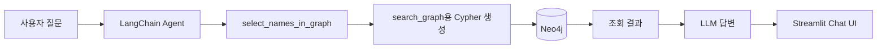
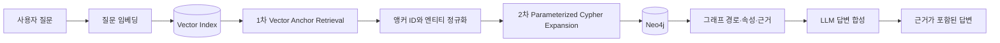

# B2B 기업 관계 지식그래프

기업의 계열·종속 관계를 Neo4j 지식그래프로 연결하고, 자연어 질문을 Cypher 조회로 변환해 기업 관계를 탐색하는 B2B 리서치 프로토타입입니다.

> 분석 기준: 2026-09-17 저장소의 코드와 데이터 산출물  
> 상태 표기: **구현**은 현재 저장소에서 확인되는 기능, **부분 구현**은 일부 코드나 산출물만 존재하는 기능, **미구현**은 기존 README에 계획되어 있으나 실행 코드가 확인되지 않는 기능입니다.

## 1. 프로젝트 배경

B2B 영업·마케팅 담당자는 신규 고객사, 협력사, 공급망 파트너를 찾기 위해 기업 홈페이지, 공시, 뉴스, 산업 자료와 내부 목록을 따로 확인합니다. 이 방식은 다음과 같은 한계가 있습니다.

- 같은 기업의 이름과 식별자가 자료마다 달라 관계를 연결하기 어렵습니다.
- 모기업, 계열회사, 종속기업을 여러 단계에 걸쳐 수작업으로 추적해야 합니다.
- 기업의 지역과 업종을 관계 정보와 함께 비교하기 어렵습니다.
- 검색 결과가 어떤 원천 행과 관계를 근거로 하는지 재확인하기 어렵습니다.

이 프로젝트는 금융위원회 기업기본정보를 정제해 기업 관계 그래프를 만들고, LangChain Agent가 Neo4j를 조회해 자연어 질문에 답하는 흐름을 구현합니다.

## 2. 프로젝트 목표

1. 법인등록번호를 중심으로 모기업과 계열회사를 식별합니다.
2. 법인등록번호가 없는 종속기업은 정규화 이름과 주소를 조합해 식별합니다.
3. 기업, 지역, 업종을 노드로 만들고 관계의 원천 행과 근거를 보존합니다.
4. 사용자의 자연어 질문을 그래프 조회로 연결합니다.
5. 장기적으로 벡터 검색과 그래프 확장을 결합한 2단계 하이브리드 GraphRAG으로 발전시킵니다.

## 3. 현재 구현 범위

### 기능 상태

| 기능 | 상태 | 현재 구현 내용 | 관련 위치 |
| --- | --- | --- | --- |
| 기업 데이터 수집 | 구현 | 금융위원회 기업기본정보 API 수집 노트북과 원천 CSV 보유 | `notebooks/data-collect.ipynb`, `data/raw/` |
| 계열회사 전처리 | 구현 | 파일 병합, 컬럼 정리, 중복 제거 후 계열회사 관계 생성 | `notebooks/data-prep_afilCmpy.ipynb` |
| 종속기업 전처리 | 구현 | 상동 주소 보완, 이름 정제, 국내 여부와 정규화 이름 생성 | `notebooks/01_subsid_merge.ipynb` ~ `03_subsid_clean.ipynb` |
| 통합 관계 데이터 생성 | 구현 | 모기업→계열사, 모기업→종속기업, 모기업→계열사→종속기업의 3개 case 통합 | `notebooks/all_data_prep.ipynb` |
| 그래프 노드·트리플 생성 | 구현 | 4개 노드 유형과 4개 관계 유형의 JSONL 산출물 생성 | `data/clean/기업관계_노드.jsonl`, `기업관계_트리플.jsonl` |
| Neo4j 적재 | 부분 구현 | 노트북에 연결·초기화·JSONL 적재 코드 존재. 독립 실행형 적재 스크립트는 없음 | `notebooks/진명.ipynb` |
| 온톨로지 | 구현 | 노드, 관계, 속성, 허용 시그니처 정의 | `src/agent/tools/graph_ontology.json` |
| 트리플 품질 검사 | 구현 | 스키마와 근거 문자열 일치 여부를 검사하고 보고서 생성 | `notebooks/validate_triples.ipynb`, `data/quality/` |
| 엔티티 존재 확인 | 구현 | 기업·지역·업종 이름이 Neo4j에 존재하는지 조회 | `select_names_in_graph` |
| Text2Cypher 그래프 조회 | 구현 | Agent가 읽기용 Cypher를 생성하고 Neo4j 결과를 반환 | `search_graph` |
| 자연어 질의응답 Agent | 구현 | LangChain Agent가 엔티티 확인과 그래프 조회 도구를 선택해 답변 | `src/agent/agent.py` |
| 대화형 Streamlit UI | 구현 | `st.session_state`로 대화 이력을 관리하고 사용 도구를 표시 | `src/streamlit/chatbot.py` |
| 소개·그래프 데모 UI | 부분 구현 | 화면과 샘플 그래프는 구현됐으나 실제 Neo4j 데이터 대신 정적 예시 사용 | `src/streamlit/app.py` |
| 기업 검색 | 부분 구현 | Agent의 정확 이름 확인 기능은 있으나 검색 결과 목록·자동완성 UI는 없음 | `select_names_in_graph` |
| 기업 상세 페이지 | 미구현 | 실제 기업 속성과 관계를 묶어 보여 주는 상세 화면 없음 | 기존 README의 MVP 계획 |
| 실제 관계 그래프 시각화 | 미구현 | 현재 그래프 화면은 샘플 노드·엣지로 구성되며 Neo4j 결과와 연결되지 않음 | 기존 README의 MVP 계획 |
| 관계 유형 분류 | 부분 구현 | 온톨로지와 그래프 산출물에는 4개 관계가 있으나 UI의 공급망·협력사·유사기업 관계는 샘플 | 온톨로지, `src/streamlit/app.py` |
| 산업 생태계 맵 | 미구현 | 산업 선택에 따른 실데이터 기반 서브그래프 탐색 기능 없음 | 기존 README의 P1 계획 |
| 유사 기업 추천 | 미구현 | 임베딩, 유사도 계산, 추천 랭킹 코드 없음 | 기존 README의 P1 계획 |
| 관계 근거 제공 | 부분 구현 | 관계에 `evidence`, `source_case`, `source_row`가 저장되지만 최종 UI에서 근거를 구조화해 표시하지 않음 | JSONL 산출물, 온톨로지 |
| 기업 규모·최근 상황 조회 | 미구현 | 데이터셋에 규모 지표와 기준 시점·최신 동향 데이터가 없음 | 기존 README의 핵심 질문 |
| Vector Anchor Retrieval | 미구현 | 임베딩 생성, 벡터 인덱스, 벡터 검색 코드 없음 | 목표 GraphRAG 1단계 |
| Two-Stage Hybrid GraphRAG | 미구현 | 현재는 Text2Cypher 중심 그래프 질의이며 벡터 앵커→Cypher 확장 흐름은 없음 | 목표 아키텍처 |

## 4. 데이터셋

### 데이터 출처

| 데이터 | 출처 | 수집 방식 | 주요 활용 |
| --- | --- | --- | --- |
| 금융위원회 기업기본정보 | [공공데이터포털](https://www.data.go.kr/data/15043184/openapi.do) | OpenAPI | 기업 마스터, 계열회사·종속기업 관계, 주소와 업종 |

원천 데이터는 `data/raw/`, 정제 데이터와 그래프 산출물은 `data/clean/`, 품질 결과는 `data/quality/`에 저장됩니다.

### 주요 정제 데이터

| 파일 | 행 | 열 | 역할 |
| --- | ---: | ---: | --- |
| `기업개요_최종.csv` | 862 | 15 | 법인등록번호 기준 기업 마스터 |
| `계열회사_전처리.csv` | 9,601 | 3 | 모기업과 계열회사 법인등록번호 관계 |
| `종속기업_정리.csv` | 13,727 | 5 | 종속기업명, 사업 내용, 국내 여부, 정규화 이름 |
| `모기업_계열사_종속기업_통합.csv` | 17,398 | 17 | 관계 유형별 모기업·계열회사·종속기업 통합 테이블 |

통합 데이터의 관계 유형은 다음과 같습니다.

| case | 관계 경로 | 행 수 | 비율 |
| ---: | --- | ---: | ---: |
| 1 | 모기업 → 계열회사 | 9,513 | 54.68% |
| 2 | 모기업 → 종속기업 | 1,831 | 10.52% |
| 3 | 모기업 → 계열회사 → 종속기업 | 6,054 | 34.80% |

세부 컬럼, 결측률과 식별 규칙은 루트의 `데이터명세.ipynb`에 정리되어 있습니다.

## 5. 지식그래프 현황

### 노드

현재 `기업관계_노드.jsonl`에는 총 **8,324개** 노드가 있습니다.

| 노드 유형 | 개수 | 주요 속성 |
| --- | ---: | --- |
| `ParentCompany` | 862 | `id`, `name`, `crno`, `address` |
| `SubsidiaryCompany` | 7,144 | `id`, `name`, `name_norm`, `address`, `domestic`, `business_content` |
| `Industry` | 301 | `id`, `name` |
| `Region` | 17 | `id`, `name` |

### 관계

현재 `기업관계_트리플.jsonl`에는 총 **16,822개** 관계가 있습니다.

| 관계 유형 | 개수 | 연결 |
| --- | ---: | --- |
| `AFFILIATED_WITH` | 1,573 | `ParentCompany` → `ParentCompany` |
| `HAS_SUBSIDIARY` | 7,821 | `ParentCompany` → `SubsidiaryCompany` |
| `IN_INDUSTRY` | 1,136 | 기업 → `Industry` |
| `LOCATED_IN` | 6,292 | 기업 → `Region` |

각 관계는 가능한 경우 다음 추적 정보를 포함합니다.

- `evidence`: 관계를 설명하는 원천 값
- `source_case`: 통합 데이터의 관계 유형
- `source_row`: 통합 데이터의 원천 행 번호

## 6. 현재 질의응답 흐름

현재 구현은 벡터 검색이 없는 **온톨로지 기반 Text2Cypher 그래프 질의 프로토타입**입니다.



1. Agent가 질문에서 기업명, 지역명 또는 업종명을 파악합니다.
2. `select_names_in_graph`가 이름과 노드 유형의 존재 여부를 확인합니다.
3. Agent가 온톨로지에 맞는 조회용 Cypher를 작성합니다.
4. `search_graph`가 Neo4j에서 관계와 속성을 조회합니다.
5. Agent가 조회 결과를 자연어로 정리합니다.
6. Streamlit 챗봇이 답변과 호출한 도구를 표시하고 대화 이력을 `st.session_state`에 보관합니다.

### 답변 가능한 질문 예시

- 특정 기업과 직접 연결된 계열회사는 어디인가?
- 특정 기업이 가진 종속기업은 무엇인가?
- 특정 지역에 위치한 기업은 무엇인가?
- 특정 업종에 연결된 기업은 무엇인가?
- 한 기업에서 다른 기업까지 어떤 관계 경로가 존재하는가?

현재 데이터와 구현만으로는 기업의 매출·인원·최신 뉴스, 거래 규모, 실제 공급망 또는 추천 점수를 답할 수 없습니다.

## 7. 목표 GraphRAG 아키텍처

프로젝트가 목표로 하는 GraphRAG은 1차 벡터 검색과 2차 그래프 확장을 분리한 2단계 하이브리드 구조입니다. 아래 구조는 **목표 설계이며 현재 미구현**입니다.



목표 구현 원칙은 다음과 같습니다.

- 1차 검색은 질문과 유사한 기업·업종·근거 문서를 벡터 인덱스에서 찾아 앵커를 결정합니다.
- 2차 검색은 앵커 ID를 파라미터화된 Cypher에 전달해 관계를 확장합니다.
- Cypher는 별도 `graph_db.py` 모듈에서 관리하고 사용자 입력을 문자열로 직접 결합하지 않습니다.
- 답변에는 기업명, 관계 유형, 경로, 원천 행 또는 문서 근거를 함께 반환합니다.
- 벡터 검색 결과가 없거나 그래프 확장이 실패하면 추정 답변을 만들지 않고 조회 한계를 표시합니다.

## 8. 예상 수요층과 요구사항

아래 내용은 현재 데이터 범위와 구현 기능을 바탕으로 한 예상 수요 분석이며, 별도의 사용자 인터뷰나 시장조사 결과는 아닙니다.

### 핵심 수요층

| 수요층 | 주요 업무 | 기대 질문 | 핵심 요구사항 | 현재 충족 수준 |
| --- | --- | --- | --- | --- |
| B2B 영업·마케팅 | 신규 계정과 연관 기업 발굴, 담당 산업 탐색 | “A사의 계열사와 종속기업은?”, “서울의 특정 업종 기업은?” | 빠른 기업 검색, 관계 필터, 목록 저장·내보내기, 근거 표시 | 부분 충족 |
| 사업개발·파트너십 | 협력 후보와 그룹사 확장 기회 탐색 | “이 기업을 통해 접근 가능한 관계사는?”, “같은 업종의 주변 기업은?” | 다단계 경로, 산업·지역 교차 필터, 유사 기업 추천 | 부분 충족 |
| 구매·공급망 담당 | 공급 후보군과 기업집단 구조 확인 | “특정 업종의 국내 종속기업은?”, “동일 그룹의 대체 후보는?” | 공급망 데이터, 대체재 추천, 관계 최신성, 위험 신호 | 대부분 미충족 |

### 확장 수요층

| 수요층 | 활용 가치 | 추가로 필요한 기능 | 현재 충족 수준 |
| --- | --- | --- | --- |
| 전략·시장조사 | 산업별 기업집단과 지역 분포의 초기 탐색 | 산업 생태계 맵, 규모 지표, 시점 비교, 보고서 내보내기 | 부분 충족 |
| 투자·M&A 리서치 | 관계사 구조와 잠재 검토 대상의 1차 스크리닝 | 지분율, 재무정보, 공시 시점, 뉴스와 공식 근거 | 미충족 |
| 신용·준법·KYB | 관련 기업과 관계 경로 확인 | 실소유자, 제재·휴폐업 정보, 감사 로그, 데이터 최신성 | 미충족 |
| 데이터·AI 개발팀 | 기업 관계 데이터와 GraphRAG 실험 | API, 평가셋, 재현 가능한 적재 파이프라인, 관측성 | 부분 충족 |

### 공통 요구사항

| 우선순위 | 요구사항 | 필요한 이유 | 구현 상태 |
| --- | --- | --- | --- |
| P0 | 정확한 기업 식별 | 동명이인과 법인 표기 차이로 인한 잘못된 연결 방지 | 부분 구현 |
| P0 | 관계 근거와 출처 표시 | 영업·조사 결과를 사용자가 검증할 수 있어야 함 | 부분 구현 |
| P0 | 데이터 기준일과 갱신 주기 | 계열·종속 관계의 시점 오류 방지 | 미구현 |
| P0 | 조회 실패와 불확실성 표시 | 데이터가 없을 때 LLM이 관계를 추정하지 않도록 함 | 부분 구현 |
| P0 | 읽기 전용·파라미터화 쿼리 | Cypher Injection과 의도하지 않은 그래프 변경 방지 | 부분 구현 |
| P1 | 산업·지역·관계 유형 필터 | 후보 기업을 실무 범위로 좁히기 위해 필요 | 그래프 질의 가능, 전용 UI 미구현 |
| P1 | 결과 내보내기 | 영업 목록, 분석 보고서와 후속 업무에 활용 | 미구현 |
| P1 | 다단계 관계 시각화 | 기업집단과 영향 경로를 빠르게 이해 | 미구현 |
| P1 | 유사 기업 추천 | 알려진 기업에서 새로운 후보로 탐색 범위 확장 | 미구현 |
| P2 | 권한·감사 로그·관측성 | 조직 단위 운영과 장애·오답 추적 | 미구현 |

## 9. 데이터 품질과 한계

### 품질 보고서 스냅샷

`data/quality/quality_report.md`는 총 12,281개 트리플을 대상으로 다음 결과를 기록하고 있습니다.

| 지표 | 값 |
| --- | ---: |
| 스키마 통과 | 11,542개 |
| 기각 | 739개 |
| 스키마 준수율 | 93.98% |
| 근거 원문 일치율 | 100.00% |

> **수동 점검 결과**
| 지표 | 값 |
| --- | ---: |
| 전체 트리플 수 | 16822 |
| 스키마 통과 트리플 수 | 15821 |
| 근거 원문 일치 트리플 수 | 16822 |
| 수동 검토 대상 수 | 15821 |
| 기각 트리플 수 | 1001 |
| 스키마 준수율 | 0.9405 |
| 근거 원문 일치율 | 1.0000 |
| 수동 검토 대상 비율 | 0.9405 |

현재 `기업관계_트리플.jsonl`은 16,822개 관계를 포함하므로 품질 보고서와 산출물의 생성 시점이 다릅니다. 현재 전체 관계에 대한 품질 지표로 사용하려면 보고서를 다시 생성해야 합니다.

### 확인된 한계

- 데이터에 명시적인 기준일·기준연도 컬럼이 없어 관계의 최신성을 판단하기 어렵습니다.
- 모기업·계열사의 주소와 업종에는 원천 데이터 결측이 많습니다.
- 종속기업에는 법인등록번호가 없어 이름과 주소 기반 식별에서 중복 또는 오매칭 가능성이 있습니다.
- `case=3`의 `top_*` 컬럼에는 여러 모기업 값이 `;`로 연결되어 있어 컬럼 간 순서를 유지해 분해해야 합니다.
- 현재 그래프는 계열·종속·지역·업종 관계를 중심으로 하며 실제 거래·공급망·협력 관계를 포함하지 않습니다.
- Streamlit 소개 화면의 공급망·협력사·유사기업 관계와 기업명은 실제 조회 결과가 아닌 샘플입니다.
- 현재 `search_graph`는 변경 키워드를 차단하지만 LLM이 만든 Cypher 문자열을 직접 실행합니다. 운영 환경에서는 Neo4j 읽기 전용 계정, 허용 쿼리 검증과 파라미터화된 쿼리가 필요합니다.

## 10. 기술 스택

| 영역 | 현재 사용 기술 | 상태 |
| --- | --- | --- |
| 데이터 수집·분석 | Python, pandas, Jupyter | 구현 |
| Agent·LLM | LangChain, LangChain OpenAI, OpenAI 모델 | 구현 |
| 그래프 데이터베이스 | Neo4j, Cypher | 구현 |
| 온톨로지 | JSON 기반 노드·관계 스키마 | 구현 |
| 챗봇 UI | Streamlit | 코드 구현, 의존성 등록 필요 |
| 벡터 검색 | OpenAI Embeddings, Vector Index | 미구현 |
| 배포 | Streamlit Cloud | 미구현 |

## 11. 저장소 구조

```text
.
├── data/
│   ├── raw/                         # API 원천 CSV
│   ├── clean/                       # 정제 CSV, 그래프 노드·트리플 JSONL
│   └── quality/                     # 트리플 품질 보고서와 요약
├── notebooks/
│   ├── data-collect.ipynb           # 기업기본정보 수집
│   ├── data-prep_afilCmpy.ipynb     # 계열회사 전처리
│   ├── 01_subsid_merge.ipynb        # 종속기업 파일 병합
│   ├── 02_subsid_check.ipynb        # 종속기업 기본·기준일 점검
│   ├── 03_subsid_clean.ipynb        # 종속기업 정제
│   ├── all_data_prep.ipynb          # 관계 통합 데이터 생성
│   ├── 진명.ipynb                    # 기업 마스터, 그래프 산출물, Neo4j 적재
│   └── validate_triples.ipynb       # 트리플 품질 검증
├── src/
│   ├── agent/
│   │   ├── agent.py                 # LangChain Agent
│   │   └── tools/
│   │       ├── graph_ontology.json  # Neo4j 온톨로지
│   │       └── text2cypher.py       # 엔티티 확인·그래프 조회 도구
│   └── streamlit/
│       ├── chatbot.py               # 실제 Agent 연동 챗봇
│       └── app.py                   # 프로젝트 소개·샘플 그래프 UI
├── 데이터명세.ipynb                 # 통합 데이터 명세
├── main.py                           # 현재 Hello World 수준의 기본 진입점
├── pyproject.toml
├── uv.lock
├── README.md                         # 기존 기획 중심 문서
└── README_v2.md                      # 현재 구현과 수요 분석을 반영한 문서
```

## 12. 실행 준비

### 요구 환경

- Python 3.12 이상
- `uv`
- 접근 가능한 Neo4j 데이터베이스
- OpenAI API 키

### 설치

```bash
uv sync
```

현재 `src/streamlit/`에서 Streamlit을 사용하지만 `pyproject.toml`에는 `streamlit` 의존성이 등록되어 있지 않습니다. Streamlit 화면을 실행하려면 먼저 의존성을 추가해야 합니다.

```bash
uv add streamlit
```

### 환경변수

루트에 `.env` 파일을 만들고 다음 값을 설정합니다. `.env`는 `.gitignore`에 포함되어 있으므로 저장소에 커밋하지 않습니다.

```dotenv
OPENAI_API_KEY=your_openai_api_key
NEO4J_URI=neo4j+s://your-instance.databases.neo4j.io
NEO4J_USER=neo4j
NEO4J_PASSWORD=your_neo4j_password
```

### 사전 데이터 적재

현재 Neo4j 적재는 자동화된 CLI가 아니라 `notebooks/진명.ipynb`의 적재 셀을 사용합니다. 실행 전 대상 데이터베이스와 초기화 쿼리의 범위를 반드시 확인해야 합니다.

### 실행 명령

콘솔 Agent:

```bash
uv run python -m src.agent.agent
```

Agent 연동 Streamlit 챗봇:

```bash
uv run streamlit run src/streamlit/chatbot.py
```

소개·샘플 그래프 화면:

```bash
uv run streamlit run src/streamlit/app.py
```

`main.py`는 현재 `Hello from mle-01-p2-team3!`만 출력하므로 서비스 진입점으로 사용하지 않습니다.

## 13. 다음 개발 우선순위

1. 현재 16,822개 관계를 기준으로 품질 보고서를 다시 생성합니다.
2. `streamlit`을 프로젝트 의존성에 정식 등록하고 실행 절차를 자동 검증합니다.
3. Neo4j 접근을 별도 `graph_db.py`로 분리하고 읽기 전용 계정과 파라미터화된 Cypher를 적용합니다.
4. 기업·업종·근거 텍스트의 임베딩과 벡터 인덱스를 구축합니다.
5. Vector Anchor Retrieval 결과의 ID를 이용해 Neo4j를 확장 조회하는 2단계 하이브리드 검색을 구현합니다.
6. 답변에 관계 경로, `evidence`, `source_case`, `source_row`를 함께 표시합니다.
7. 실제 Neo4j 결과를 관계 그래프 UI와 기업 상세 페이지에 연결합니다.
8. 산업 생태계 맵, 유사 기업 추천, 결과 내보내기를 순차적으로 구현합니다.
9. 기준일과 갱신 주기를 데이터 모델에 추가하고 정기 적재 파이프라인을 구성합니다.

## 14. 기대 효과

- 기업별 계열·종속 관계 조사 시간을 줄일 수 있습니다.
- 기업명 검색만으로 관련 기업, 지역과 업종을 함께 탐색할 수 있습니다.
- 원천 행과 관계 근거를 보존해 그래프 답변을 검토할 수 있습니다.
- 향후 벡터 검색과 그래프 확장을 결합하면 정확한 엔티티 탐색과 다단계 관계 추론을 함께 제공할 수 있습니다.

